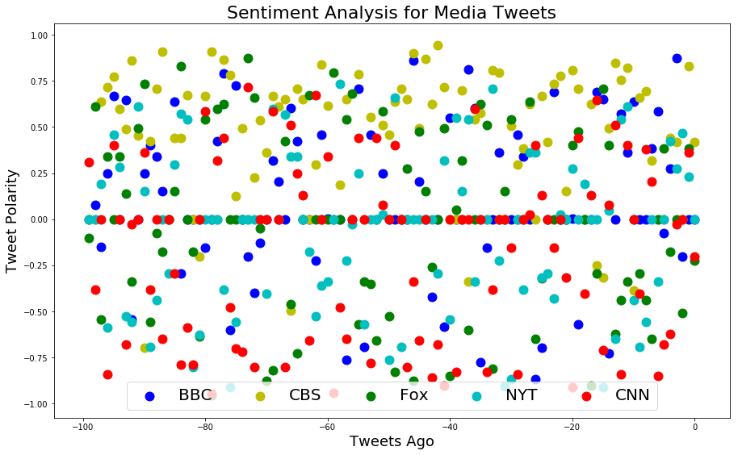
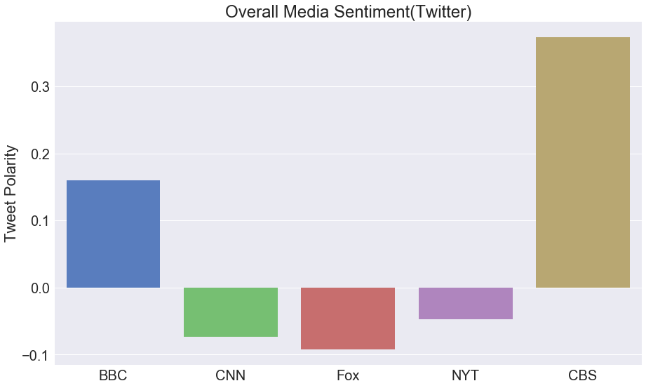

# News Mood
## John M Warlop

# Dependencies


```python
import tweepy
import json
import pandas as pd
import requests
import pickle
```

# Constants


```python
handles = {'BBC':'@BBC', 'CBS':'@CBS', 'NYTimes':'@nytimes', 'Fox':'@FoxNews', 'CNN':'@CNN'}
type_handles = ['compound','neu','neg','pos','dtime']
```

# Functions


```python
def get_keys():
    s_fname = 'api_keys'
    api_keys = {}
    with open(s_fname) as f:
        api_keys = json.load(f)
    f.close()
    return(api_keys)

def pickle_it(data,fname):
    import pickle
    pckl_out = open(fname,"wb")
    pickle.dump(data,pckl_out)
    pckl_out.close()

def logging_(log_name):
    import logging
    LOG_FORMAT = "%(levelname)s %(asctime)s - %(message)s"
    logging.basicConfig(filename=log_name,level=logging.INFO,format=LOG_FORMAT,filemode='w')
    return(logging.getLogger())

def twitter_handshake(api_keys):
    auth = tweepy.OAuthHandler(api_keys['consumer_key'],api_keys['consumer_secret_key'])
    auth.set_access_token(api_keys['access_token'],api_keys['access_token_secret'])
    api = tweepy.API(auth,parser=tweepy.parsers.JSONParser())
    return(api)

def sentiment_analysis(tweet):
    # Import and Initialize Sentiment Analyzer
    from vaderSentiment.vaderSentiment import SentimentIntensityAnalyzer
    analyzer = SentimentIntensityAnalyzer()
    #results is dict{'compound':w,'neg':x,'neu':y,''pos':z} where w,x,y and z are floats
    return(analyzer.polarity_scores(tweet)) 

def return_data_vector(data,name,type_):
    the_list = data[name]
    r_vector = []
    for idx, cell in enumerate(the_list):
        r_vector.append(cell[type_])
    return(r_vector)

def combine_vectors(data):
    all_vectors = {}
    for key,val in handles.items():
        all_vectors[key]={}
        for sentiment_param in type_handles:
            all_vectors[key][sentiment_param]=return_data_vector(data,key,sentiment_param)
    return(all_vectors)


    
    
```

# Solution Space


```python
# Logging
logger = logging_("main.log")
```


```python
# Twitter API Keys
logger.info("Loading API keys")
api_keys = get_keys()
logger.info("Keys loaded")
```


```python
# Tweepy/Twitter Handshake
logger.info("Sending keys to twitter")
api = twitter_handshake(api_keys)
logger.info("Keys accepted by twitter")
```

# Pickle Tweets 


```python
last_200_tweets = {}
for idx, key in enumerate(handles): #Loop through spewers of fake news('CNN','FOX', etc)
    public_tweets = api.user_timeline(handles[key],count=200,tweet_mode="extended")
    last_200_tweets[key]=public_tweets
pickle_it(last_200_tweets,"last_200_tweets.pkl")
del(last_200_tweets)
```

# Open Pickle


```python
pkl_in = open("last_200_tweets.pkl","rb")
last_200_tweets = pickle.load(pkl_in)
pkl_in.close()
```

# Sentimate Analysis => analysis_store


```python
analysis_store = {}
for idx0,fake_news in enumerate(last_200_tweets): #Loop through spewers of fake news(CNN,FOX, etc)
    logger.info("Analyzing sentiment for {}".format(fake_news))
    analysis_store[fake_news] = []
    for idx1, e in enumerate(last_200_tweets[fake_news]):
        analysis = sentiment_analysis(last_200_tweets[fake_news][idx1]['full_text'])
        tweet_dtime = last_200_tweets[fake_news][idx1]['created_at']
        analysis['dtime']=tweet_dtime
        analysis_store[fake_news].append(analysis)
        if idx1 % 20 == 0:
            logger.info("{} analysis is: {}".format(fake_news,analysis))
            logger.info("Analyzing tweet {} of {} from {}".\
                        format(idx1,len(last_200_tweets[fake_news]),fake_news))
        uname = e['user']['name']
```

# Pickle Sentiment(save analysis_store)


```python
#analysis_store['CNN'][55] retrieves 55th tweet
pickle_it(analysis_store,"sentiment_analysis.pkl")
```

# Unpickle to analysis_store


```python
pkl_in = open("sentiment_analysis.pkl","rb")
analysis_store = pickle.load(pkl_in)
pkl_in.close()
```

# Do Sentiment Analysis


```python
fake_news_vectors = combine_vectors(analysis_store)
#fake_news_vectors['CBS']['dtime']
```

# Put Sentiment Analysis in DataFrame and Pickle(save df)


```python
df_data = {}
for fake_news_name in fake_news_vectors:
    for type_ in type_handles:
        df_data[fake_news_name+'_'+type_] = fake_news_vectors[fake_news_name][type_]
df = pd.DataFrame(df_data)
pickle_it(df,"fake_news_sentiment_analysis_df.pkl")
```

# Save Dataframe(df) to CSV


```python
df.to_csv('df.csv')
del(df)
```

# Unpickle to DataFrame


```python
import pickle
pkl_in = open("fake_news_sentiment_analysis_df.pkl","rb")
df = pickle.load(pkl_in)
pkl_in.close()
df = df.iloc[::-1] #flip table
```

# Plot Compound Scores


```python
import matplotlib.pyplot as plt
#import pandas as pd
xr = [i for i in range(-1*df.shape[0]+1,1)]
df['tago']=xr
df.head()

```


<div>
<style>
    .dataframe thead tr:only-child th {
        text-align: right;
    }

    .dataframe thead th {
        text-align: left;
    }

    .dataframe tbody tr th {
        vertical-align: top;
    }
</style>
<table border="1" class="dataframe">
  <thead>
    <tr style="text-align: right;">
      <th></th>
      <th>BBC_compound</th>
      <th>BBC_dtime</th>
      <th>BBC_neg</th>
      <th>BBC_neu</th>
      <th>BBC_pos</th>
      <th>CBS_compound</th>
      <th>CBS_dtime</th>
      <th>CBS_neg</th>
      <th>CBS_neu</th>
      <th>CBS_pos</th>
      <th>...</th>
      <th>Fox_dtime</th>
      <th>Fox_neg</th>
      <th>Fox_neu</th>
      <th>Fox_pos</th>
      <th>NYTimes_compound</th>
      <th>NYTimes_dtime</th>
      <th>NYTimes_neg</th>
      <th>NYTimes_neu</th>
      <th>NYTimes_pos</th>
      <th>tago</th>
    </tr>
  </thead>
  <tbody>
    <tr>
      <th>199</th>
      <td>0.4404</td>
      <td>Fri Mar 30 09:06:02 +0000 2018</td>
      <td>0.00</td>
      <td>0.884</td>
      <td>0.116</td>
      <td>0.4588</td>
      <td>Mon Jan 29 03:46:27 +0000 2018</td>
      <td>0.000</td>
      <td>0.727</td>
      <td>0.273</td>
      <td>...</td>
      <td>Sat Apr 07 21:11:08 +0000 2018</td>
      <td>0.102</td>
      <td>0.898</td>
      <td>0.000</td>
      <td>0.2944</td>
      <td>Fri Apr 06 15:55:02 +0000 2018</td>
      <td>0.058</td>
      <td>0.834</td>
      <td>0.108</td>
      <td>-199</td>
    </tr>
    <tr>
      <th>198</th>
      <td>0.2500</td>
      <td>Fri Mar 30 10:03:04 +0000 2018</td>
      <td>0.00</td>
      <td>0.926</td>
      <td>0.074</td>
      <td>0.5994</td>
      <td>Mon Jan 29 03:49:19 +0000 2018</td>
      <td>0.000</td>
      <td>0.606</td>
      <td>0.394</td>
      <td>...</td>
      <td>Sat Apr 07 21:12:53 +0000 2018</td>
      <td>0.193</td>
      <td>0.807</td>
      <td>0.000</td>
      <td>0.0000</td>
      <td>Fri Apr 06 16:12:51 +0000 2018</td>
      <td>0.000</td>
      <td>1.000</td>
      <td>0.000</td>
      <td>-198</td>
    </tr>
    <tr>
      <th>197</th>
      <td>0.0000</td>
      <td>Fri Mar 30 10:33:02 +0000 2018</td>
      <td>0.00</td>
      <td>1.000</td>
      <td>0.000</td>
      <td>0.6114</td>
      <td>Mon Jan 29 03:50:25 +0000 2018</td>
      <td>0.000</td>
      <td>0.688</td>
      <td>0.312</td>
      <td>...</td>
      <td>Sat Apr 07 21:17:57 +0000 2018</td>
      <td>0.040</td>
      <td>0.784</td>
      <td>0.176</td>
      <td>0.0000</td>
      <td>Fri Apr 06 16:17:06 +0000 2018</td>
      <td>0.000</td>
      <td>1.000</td>
      <td>0.000</td>
      <td>-197</td>
    </tr>
    <tr>
      <th>196</th>
      <td>0.4574</td>
      <td>Fri Mar 30 10:39:54 +0000 2018</td>
      <td>0.09</td>
      <td>0.697</td>
      <td>0.213</td>
      <td>0.0572</td>
      <td>Mon Jan 29 03:53:06 +0000 2018</td>
      <td>0.062</td>
      <td>0.864</td>
      <td>0.073</td>
      <td>...</td>
      <td>Sat Apr 07 21:25:36 +0000 2018</td>
      <td>0.270</td>
      <td>0.615</td>
      <td>0.115</td>
      <td>0.0000</td>
      <td>Fri Apr 06 16:25:06 +0000 2018</td>
      <td>0.000</td>
      <td>1.000</td>
      <td>0.000</td>
      <td>-196</td>
    </tr>
    <tr>
      <th>195</th>
      <td>0.4574</td>
      <td>Fri Mar 30 12:04:01 +0000 2018</td>
      <td>0.00</td>
      <td>0.917</td>
      <td>0.083</td>
      <td>-0.3400</td>
      <td>Mon Jan 29 03:55:20 +0000 2018</td>
      <td>0.112</td>
      <td>0.888</td>
      <td>0.000</td>
      <td>...</td>
      <td>Sat Apr 07 21:25:46 +0000 2018</td>
      <td>0.384</td>
      <td>0.616</td>
      <td>0.000</td>
      <td>-0.8126</td>
      <td>Fri Apr 06 16:40:08 +0000 2018</td>
      <td>0.296</td>
      <td>0.704</td>
      <td>0.000</td>
      <td>-195</td>
    </tr>
  </tbody>
</table>
<p>5 rows × 26 columns</p>
</div>


```python
plt.rcParams['figure.figsize']=(15,9)
#df.plot.scatter(x='tago',y='BBC',c=['g'],s=50)
#ax = df.plot(kind='scatter', x='tago', y='BBC', color='r')    
#df.plot(kind='scatter', x='tago', y='CBS',color='g')
fig = plt.figure()
ax = fig.add_subplot(111)
sz=120
sz2 = 100 #Requirements call for last 100 tweets
ax.scatter(xr[100:], df['BBC_compound'].tolist()[100:], s=sz, c='b', marker="o", label='BBC')
ax.scatter(xr[100:],df['CBS_compound'].tolist()[100:],s=sz,c='y',marker='o',label='CBS')
ax.scatter(xr[100:],df['Fox_compound'].tolist()[100:],s=sz,c='g',marker='o',label='Fox')
ax.scatter(xr[100:],df['NYTimes_compound'].tolist()[100:],s=sz,c='c',marker='o',label='NYT')
ax.scatter(xr[100:],df['CNN_compound'].tolist()[100:],s=sz,c='r',marker='o',label='CNN')
plt.legend(loc='lower center',ncol=2);
ax.legend(frameon=True, loc='lower center', ncol=5, fontsize=20)
ax.set_title('Sentiment Analysis for Media Tweets',fontsize=22)
ax.set_xlabel('Tweets Ago',fontsize=18)
ax.set_ylabel('Tweet Polarity',fontsize=18)
plt.show()

```





# Save Scatterplot


```python
fig.savefig('sentiment_analysis_scatter.png')
```

# Bar Chart (using Seaborn)


```python
import seaborn as sns
bbc_mean = sum(df['BBC_compound'].tolist()[0:sz2])/sz2
cnn_mean = sum(df['CNN_compound'].tolist()[0:sz2])/sz2
fox_mean = sum(df['Fox_compound'].tolist()[0:sz2])/sz2
nyt_mean = sum(df['NYTimes_compound'].tolist()[0:sz2])/sz2
cbs_mean = sum(df['CBS_compound'].tolist()[0:sz2])/sz2
sns.set_style("darkgrid")
sns.set(font_scale=2)  # kinda big
bar_plot = sns.barplot(x=pd.Series(['BBC','CNN','Fox','NYT','CBS']),\
                       y=pd.Series([bbc_mean,cnn_mean,fox_mean,nyt_mean,cbs_mean]),\
                       palette = "muted")
bar_plot.set(ylabel='Tweet Polarity',title='Overall Media Sentiment(Twitter)')

plt.xticks(rotation=0)
plt.show()
```





# Save Seaborn BarPlot


```python
fig = bar_plot.get_figure()
fig.savefig('sentiment_analysis_bar.png')
```

# Save DataFrame to CSV


```python
df.to_csv('sentiment_analysis.csv')
```
